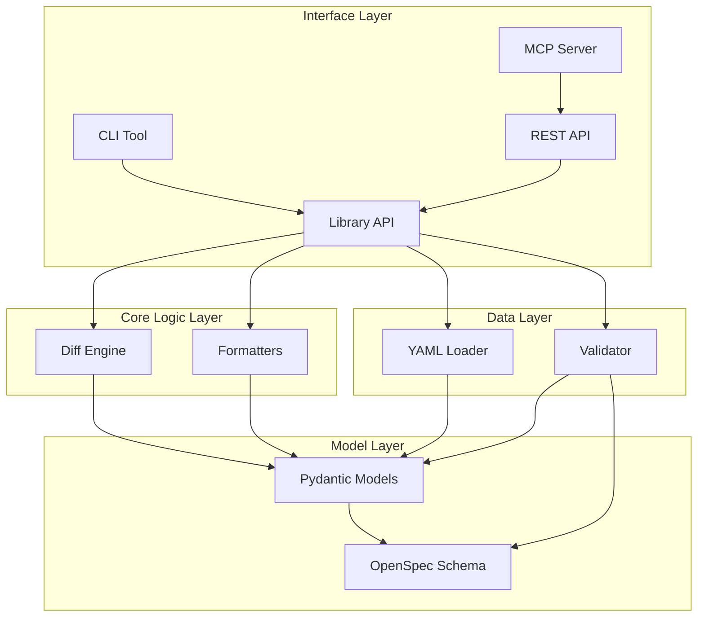

# Architecture

This document describes the system architecture of yaml-diffs, including component relationships, design decisions, and extension points.

## Overview

yaml-diffs is a Python library for representing Hebrew legal and regulatory documents in a flexible, nested YAML format. The system is designed with a layered architecture that separates concerns and enables multiple interfaces.

## Architecture Layers

The system is organized into four main layers:

```
┌─────────────────────────────────────────┐
│      Interface Layer                    │
│  (CLI, Library API, REST API, MCP)     │
└─────────────────────────────────────────┘
              ↓
┌─────────────────────────────────────────┐
│      Core Logic Layer                   │
│  (Diff Engine, Formatters)              │
└─────────────────────────────────────────┘
              ↓
┌─────────────────────────────────────────┐
│      Data Layer                         │
│  (Loader, Validator)                    │
└─────────────────────────────────────────┘
              ↓
┌─────────────────────────────────────────┐
│      Model Layer                        │
│  (Pydantic Models, OpenSpec Schema)     │
└─────────────────────────────────────────┘
```

### Interface Layer

The interface layer provides multiple ways to interact with the system:

- **CLI Tool** (`yaml-diffs` command) - Command-line interface for quick operations
- **Library API** (`yaml_diffs` package) - Python library for programmatic use
- **REST API** (FastAPI server) - HTTP endpoints for remote access
- **MCP Server** - Model Context Protocol server for AI assistants

**Key Components:**
- `src/yaml_diffs/cli/` - CLI implementation
- `src/yaml_diffs/api.py` - Main library API
- `src/yaml_diffs/api_server/` - REST API server
- `src/yaml_diffs/mcp_server/` - MCP server

### Core Logic Layer

The core logic layer implements the main business logic:

- **Diff Engine** - Marker-based document diffing algorithm
- **Formatters** - Output formatting (JSON, text, YAML)

**Key Components:**
- `src/yaml_diffs/diff.py` - Diff engine implementation
- `src/yaml_diffs/formatters/` - Formatter implementations

### Data Layer

The data layer handles data loading and validation:

- **YAML Loader** - Loads and parses YAML files with UTF-8 support
- **Validator** - Validates documents against OpenSpec schema and Pydantic models

**Key Components:**
- `src/yaml_diffs/loader.py` - YAML loading utilities
- `src/yaml_diffs/validator.py` - Validation logic

### Model Layer

The model layer defines the data structures:

- **Pydantic Models** - Python runtime validation models
- **OpenSpec Schema** - Language-agnostic contract definition

**Key Components:**
- `src/yaml_diffs/models/` - Pydantic models (Document, Section)
- `src/yaml_diffs/schema/legal_document_spec.yaml` - OpenSpec schema

## Component Relationships



## Data Flow

### Document Loading Flow

```
YAML File
    ↓
YAML Loader (UTF-8 parsing)
    ↓
Raw Python Dict
    ↓
Pydantic Validation
    ↓
Document Model
```

### Document Diffing Flow

```
Old Document + New Document
    ↓
Diff Engine (Marker-based matching)
    ↓
Change Detection
    ↓
DiffResult Objects
    ↓
Formatter (JSON/Text/YAML)
    ↓
Formatted Output
```

### Validation Flow

```
YAML File
    ↓
YAML Loader
    ↓
OpenSpec Validation
    ↓
Pydantic Validation
    ↓
Validated Document
```

## Key Design Decisions

### 1. Marker-Based Diffing

**Decision:** Use markers (not IDs) as primary identifiers for diffing.

**Rationale:**
- Markers are semantic identifiers (e.g., "1", "א", "(a)")
- IDs are stable but not semantic
- Markers enable human-readable diff results
- Supports Hebrew legal document conventions

**Trade-off:** Requires marker uniqueness validation at each nesting level.

### 2. Dual Validation System

**Decision:** Validate against both OpenSpec schema and Pydantic models.

**Rationale:**
- OpenSpec provides language-agnostic contract
- Pydantic provides Python runtime validation
- Dual validation ensures consistency across implementations
- OpenSpec can be used by non-Python implementations

**Trade-off:** Slightly slower validation, but ensures correctness.

### 3. Recursive Section Structure

**Decision:** Use recursive sections with unlimited nesting depth.

**Rationale:**
- Legal documents have deeply nested structures
- Recursive structure is natural for legal documents
- No artificial depth limits
- Flexible for various document types

**Trade-off:** Requires careful handling of deep recursion in algorithms.

### 4. Multiple Interface Layers

**Decision:** Provide CLI, library, REST API, and MCP server interfaces.

**Rationale:**
- Different use cases require different interfaces
- CLI for quick operations
- Library for programmatic use
- REST API for remote access
- MCP server for AI assistants

**Trade-off:** More code to maintain, but better usability.

### 5. UTF-8 Hebrew Support

**Decision:** Full UTF-8 support for Hebrew content throughout.

**Rationale:**
- Target use case is Hebrew legal documents
- UTF-8 is standard encoding
- Proper handling of RTL text
- Support for Hebrew markers and content

**Trade-off:** Requires careful encoding handling in all components.

## Extension Points

### Adding a New Formatter

1. Create a new formatter class in `src/yaml_diffs/formatters/`
2. Implement the formatter interface
3. Register in `src/yaml_diffs/formatters/__init__.py`
4. Add to `format_diff()` function

### Adding a New Interface

1. Create interface module (e.g., `src/yaml_diffs/graphql_server/`)
2. Use the library API (`yaml_diffs.api`) for core functionality
3. Add interface-specific logic
4. Document in appropriate documentation section

### Extending the Schema

1. Update `src/yaml_diffs/schema/legal_document_spec.yaml`
2. Update Pydantic models in `src/yaml_diffs/models/`
3. Update validation logic in `src/yaml_diffs/validator.py`
4. Update tests
5. Update documentation

### Adding New Diff Change Types

1. Add to `ChangeType` enum in `src/yaml_diffs/diff_types.py`
2. Update diff engine logic in `src/yaml_diffs/diff.py`
3. Update formatters to handle new type
4. Update tests
5. Update documentation

## File Organization

```
src/yaml_diffs/
├── __init__.py              # Package exports
├── api.py                   # Main library API
├── loader.py                # YAML loading
├── validator.py             # Validation logic
├── diff.py                  # Diff engine
├── diff_types.py            # Diff types and models
├── exceptions.py            # Custom exceptions
├── models/                  # Pydantic models
│   ├── document.py
│   └── section.py
├── schema/                  # OpenSpec schema
│   └── legal_document_spec.yaml
├── formatters/              # Output formatters
│   ├── json_formatter.py
│   ├── text_formatter.py
│   └── yaml_formatter.py
├── cli/                     # CLI tool
│   ├── main.py
│   └── commands.py
├── api_server/              # REST API
│   ├── main.py
│   └── routers/
└── mcp_server/              # MCP server
    ├── server.py
    └── tools.py
```

## Testing Architecture

The test suite is organized to match the code structure:

```
tests/
├── test_models.py           # Model tests
├── test_loader.py           # Loader tests
├── test_validator.py        # Validator tests
├── test_diff.py             # Diff engine tests
├── test_formatters.py       # Formatter tests
├── test_api.py              # Library API tests
├── test_cli.py              # CLI tests
└── test_api_server.py       # REST API tests
```

## Performance Considerations

### Document Loading

- YAML parsing is done with `pyyaml` (C extension for speed)
- UTF-8 encoding is handled efficiently
- Large documents are loaded incrementally

### Diff Algorithm

- Marker-based matching is O(n) for same structure
- Content similarity uses efficient string comparison
- Deep nesting is handled recursively

### Validation

- OpenSpec validation happens first (faster failure)
- Pydantic validation provides detailed errors
- Validation can be skipped if document is already validated

## Security Considerations

### Input Validation

- All inputs are validated against schemas
- YAML parsing uses `safe_load()` to prevent code execution
- File paths are sanitized to prevent directory traversal

### Error Handling

- Errors don't expose internal details
- Validation errors provide actionable messages
- Custom exceptions for clear error handling

## Related Documentation

- [Contributing Guide](contributing.md) - How to contribute
- [API Reference](api_reference.md) - Complete API documentation
- [Schema Reference](../user/schema_reference.md) - Schema documentation
- [AGENTS.md](../../AGENTS.md) - AI agent development guide
