# Diffing Algorithms

This document provides detailed explanations of the diffing algorithms used in yamly, including workflow diagrams and comprehensive descriptions of how each change type is detected.

## Overview

yamly supports two distinct diffing modes, each optimized for different use cases:

- **Generic YAML Diff Mode**: For any YAML file (configs, Kubernetes manifests, etc.) using path-based tracking and smart array matching
- **Legal Document Diff Mode**: For schema-validated Hebrew legal documents using marker-based section matching

Both modes implement sophisticated algorithms to accurately detect changes, including additions, deletions, modifications, renames, and moves. The algorithms are designed to handle complex nested structures and provide meaningful change detection even when items are reordered or restructured.

## Generic YAML Diff Mode

The generic YAML diff mode uses a **3-phase algorithm** to detect changes in arbitrary YAML structures. The algorithm recursively compares nodes, detects local changes, then performs global analysis to identify renames and moves.

### Algorithm Summary

The generic diff algorithm works in three phases: (1) **Recursive Local Diff** - compares nodes at the same paths, detecting value changes, key additions/removals, and array item changes using a 4-phase array matching algorithm; (2) **Rename Detection** - matches removed and added keys with similar values at the same parent path, converting them to KEY_RENAMED; (3) **Global Move Detection** - matches remaining removed vs added items globally by identity or content similarity, converting them to KEY_MOVED or ITEM_MOVED. This cascading approach ensures high-confidence matches are identified first, then lower-confidence matches are handled separately, preventing false positives.

### Workflow Diagram



```mermaid
flowchart TD
    Start([Start: Generic YAML Diff]) --> Phase1Start

    subgraph Phase1["🔵 PHASE 1: Recursive Local Diff"]
        Phase1Start[Start Phase 1] --> CheckType{Node Type Match?}

        CheckType -->|Types Different| TypeChanged[🔴 TYPE_CHANGED]

        CheckType -->|Types Match| NodeType{Node Structure?}

        NodeType -->|Dictionary| DictProcess[For each key in dictionary]
        DictProcess -->|Key in both| Recurse[Recurse into nested structure]
        DictProcess -->|Key only in new| KeyAdded[🟢 KEY_ADDED]
        DictProcess -->|Key only in old| KeyRemoved[🔴 KEY_REMOVED]
        Recurse --> CheckType

        NodeType -->|Array| ArrayProcess[Array Matching Algorithm]
        ArrayProcess --> ArrayMatch1[1. Match by identity field<br/>id, name, key, etc.]
        ArrayMatch1 -->|Matched| ArrayCheck1{Changed?}
        ArrayCheck1 -->|Yes| ItemChanged[🔵 ITEM_CHANGED]
        ArrayCheck1 -->|No| Unchanged[⚪ UNCHANGED]

        ArrayMatch1 -->|Not matched| ArrayMatch2[2. Match by similarity ≥90%]
        ArrayMatch2 -->|Matched| ArrayCheck2{Changed?}
        ArrayCheck2 -->|Yes| ItemChanged
        ArrayCheck2 -->|No| Unchanged

        ArrayMatch2 -->|Not matched| ArrayMatch3[3. Match by similarity ≥70%]
        ArrayMatch3 -->|Matched| ArrayCheck3{Changed?}
        ArrayCheck3 -->|Yes| ItemChanged
        ArrayCheck3 -->|No| Unchanged

        ArrayMatch3 -->|Not matched| ArrayMatch4[4. Match identical by position]
        ArrayMatch4 -->|Matched| Unchanged

        ArrayMatch4 -->|Not matched| ArrayRemaining[Remaining items]
        ArrayRemaining -->|In old only| ItemRemoved[🔴 ITEM_REMOVED]
        ArrayRemaining -->|In new only| ItemAdded[🟢 ITEM_ADDED]

        NodeType -->|Scalar| ScalarCheck{Values equal?}
        ScalarCheck -->|No| ValueChanged[🔵 VALUE_CHANGED]
        ScalarCheck -->|Yes| Unchanged

        TypeChanged --> Phase1End
        KeyAdded --> Phase1End
        KeyRemoved --> Phase1End
        ItemChanged --> Phase1End
        ItemRemoved --> Phase1End
        ItemAdded --> Phase1End
        ValueChanged --> Phase1End
        Unchanged --> Phase1End

        Phase1End[Phase 1 Complete<br/>All changes collected in context]
    end

    Phase1End --> Phase2Start

    subgraph Phase2["🟠 PHASE 2: Rename Detection"]
        Phase2Start[Start Phase 2] --> RenameCheck{Removed key + Added key<br/>at same parent path?}
        RenameCheck -->|Yes, value similarity ≥90%| KeyRenamed[🟡 KEY_RENAMED<br/>Replaces KEY_REMOVED + KEY_ADDED]
        RenameCheck -->|No| Phase2End
        KeyRenamed --> Phase2End[Phase 2 Complete]
    end

    Phase2End --> Phase3Start

    subgraph Phase3["🟣 PHASE 3: Move Detection"]
        Phase3Start[Start Phase 3] --> KeyMoveCheck{Removed key + Added key<br/>same key name, different path?}
        KeyMoveCheck -->|Yes, value similarity ≥90%| KeyMoved[🟣 KEY_MOVED<br/>Replaces KEY_REMOVED + KEY_ADDED]
        KeyMoveCheck -->|No| ItemMoveCheck

        ItemMoveCheck{Removed item + Added item<br/>same identity, different path?}
        ItemMoveCheck -->|Yes| ItemMoved[🟣 ITEM_MOVED<br/>Replaces ITEM_REMOVED + ITEM_ADDED]
        ItemMoveCheck -->|No| Phase3End

        KeyMoved --> Phase3End
        ItemMoved --> Phase3End[Phase 3 Complete]
    end

    Phase3End --> Finalize[Calculate Statistics<br/>Return GenericDiff]
    Finalize --> End([End])

    %% Styling
    style Phase1 fill:#e1f5ff,stroke:#0066cc,stroke-width:3px
    style Phase2 fill:#fff4e1,stroke:#cc6600,stroke-width:3px
    style Phase3 fill:#ffe1f5,stroke:#cc0066,stroke-width:3px
    style TypeChanged fill:#ffcccc,stroke:#cc0000
    style KeyAdded fill:#ccffcc,stroke:#00cc00
    style KeyRemoved fill:#ffcccc,stroke:#cc0000
    style KeyRenamed fill:#ffffcc,stroke:#cccc00
    style KeyMoved fill:#ffccff,stroke:#cc00cc
    style ItemAdded fill:#ccffcc,stroke:#00cc00
    style ItemRemoved fill:#ffcccc,stroke:#cc0000
    style ItemChanged fill:#ccccff,stroke:#0000cc
    style ItemMoved fill:#ffccff,stroke:#cc00cc
    style ValueChanged fill:#ccccff,stroke:#0000cc
    style Unchanged fill:#e0e0e0,stroke:#666666
    style Finalize fill:#f0f0f0,stroke:#333333,stroke-width:2px
```

### Phase 1: Recursive Local Diff

Phase 1 performs a recursive comparison of nodes at the same paths in the document structure. It handles three types of nodes:

#### Dictionary (Mapping) Processing

For dictionaries, the algorithm:
- Compares keys present in both versions and recurses into nested structures
- Detects keys present only in the new version as `KEY_ADDED`
- Detects keys present only in the old version as `KEY_REMOVED`

#### Array (Sequence) Processing

Array matching uses a **4-phase algorithm** to match items between old and new arrays:

1. **Identity Field Matching**: Matches items by identity fields (auto-detected: `id`, `_id`, `uuid`, `key`, `name`, `host`, `hostname`, or custom rules). Items with matching identity values are considered the same item.

2. **Content Similarity (90% threshold)**: For unmatched items, calculates structural similarity using word-based Jaccard similarity. Items with ≥90% similarity are matched. This catches items that are very similar (likely the same item with minor edits).

3. **Content Similarity (70% threshold)**: For remaining unmatched items, tries matching with ≥70% similarity. This catches items that are moderately similar (likely the same item with more substantial edits).

4. **Positional Fallback**: Matches identical items by position as a last resort for items without identity fields and low similarity.

5. **Remaining Items**: Items that couldn't be matched are classified as `ITEM_ADDED` (in new only) or `ITEM_REMOVED` (in old only).

**Why Two Similarity Thresholds?** The cascading approach (90% then 70%) ensures high-confidence matches are paired first, preventing false matches. A 75% similar item won't match at 90% threshold, but will match at 70% threshold from the remaining pool. This balances precision (avoiding false matches) with recall (catching true matches even after significant changes).

#### Scalar Processing

For scalar values (strings, numbers, booleans, etc.):
- If values are equal → `UNCHANGED`
- If values differ → `VALUE_CHANGED`

#### Type Changes

If the node type changes between versions (e.g., string → number, dict → list), it's detected as `TYPE_CHANGED` and processing stops for that branch.

### Phase 2: Rename Detection

Phase 2 analyzes the context collected in Phase 1 to detect renamed keys. It looks for pairs of `KEY_REMOVED` and `KEY_ADDED` entries that:
- Are at the same parent path
- Have different key names
- Have values with ≥90% similarity

When such a pair is found, both entries are replaced with a single `KEY_RENAMED` entry, indicating the key name changed but the value remained essentially the same.

**Example:**
```yaml
# Old version
database:
  hostname: "db.example.com"

# New version
database:
  host: "db.example.com"  # Renamed from hostname
```

### Phase 3: Global Move Detection

Phase 3 performs global analysis to detect moved keys and items:

- **KEY_MOVED**: Detects when a removed key and added key have the same key name but different paths, with ≥90% value similarity. This indicates the key+value was moved to a different location in the document.

- **ITEM_MOVED**: Detects when a removed item and added item have the same identity but different paths. This indicates an array item was moved to a different array or location.

Both move types replace the original `KEY_REMOVED`/`KEY_ADDED` or `ITEM_REMOVED`/`ITEM_ADDED` pairs with a single move entry.

### Change Types

The generic diff mode detects the following change types:

| Change Type | Description | Example |
|------------|-------------|---------|
| `VALUE_CHANGED` | Same key/item, different value | `port: 8080` → `port: 9090` |
| `TYPE_CHANGED` | Node type changed | `count: "5"` → `count: 5` |
| `KEY_ADDED` | New key in mapping | New `timeout` key added |
| `KEY_REMOVED` | Key removed from mapping | `retries` key removed |
| `KEY_RENAMED` | Key name changed, value same | `hostname` → `host` |
| `KEY_MOVED` | Key+value moved to different path | `config.db.host` → `database.host` |
| `ITEM_ADDED` | New item in array | New container in list |
| `ITEM_REMOVED` | Item removed from array | Container deleted |
| `ITEM_CHANGED` | Same item (by identity), content changed | Container config modified |
| `ITEM_MOVED` | Item moved to different array/path | Container moved to different list |
| `UNCHANGED` | No changes detected | Value identical |

### Implementation

The generic diff algorithm is implemented in:
- **Main function**: `diff_yaml_generic()` in `src/yamly/generic_diff.py`
- **Phase 1**: `diff_node()` and `diff_sequence()` functions
- **Phase 2**: `detect_renames()` function
- **Phase 3**: `detect_moves()` function

## Legal Document Diff Mode

The legal document diff mode uses **marker-based matching** to detect changes in Hebrew legal documents. Sections are matched by their markers (structural identifiers like "1", "א", "(a)") rather than IDs, enabling reliable diffing across document versions even when sections are reordered or restructured.

### Algorithm Summary

The legal document diff algorithm builds marker maps for both document versions, then: (1) finds exact matches (same marker + same parent marker path) and detects content/title changes; (2) detects moved sections by content similarity (≥95% threshold) for unmatched sections; (3) classifies remaining unmatched sections as added or removed. The algorithm uses content similarity to detect movements even when markers change, and can record multiple change types for a single section (e.g., both MOVED and TITLE_CHANGED).

### Workflow Diagram


### Marker-Based Matching

The algorithm uses **markers** (structural identifiers like "1", "א", "(a)") as the primary identifiers for matching sections, not IDs. This approach:

- **Enables semantic matching**: Markers are human-readable and reflect document structure
- **Handles reordering**: Sections can be matched even when their position changes
- **Supports Hebrew conventions**: Works with Hebrew legal document numbering systems

Markers must be unique within the same nesting level. The algorithm validates this before processing.

### Building Marker Maps

For each document, the algorithm builds a marker map that associates `(marker, parent_marker_path)` tuples with sections. This allows:
- Fast lookup of sections by marker and location
- Tracking of section paths through the document hierarchy
- Detection of sections that moved to different parent sections

### Exact Match Detection

Sections with the same marker and same parent marker path are considered exact matches. For these sections, the algorithm checks:
- **Content changes**: If the `content` field differs → `CONTENT_CHANGED`
- **Title changes**: If the `title` field differs → `TITLE_CHANGED`
- **Both can occur**: A section can have both change types recorded separately
- **No changes**: If both content and title are identical → `UNCHANGED`

### Movement Detection

Sections that don't have exact matches are analyzed for movement. The algorithm:
- Calculates content similarity using word-based Jaccard similarity
- Matches sections with ≥95% content similarity (one-to-one matching)
- Filters out empty content sections (parent sections) to avoid false positives
- Records `SECTION_MOVED` when a match is found

**Important**: Movement detection is based on content similarity, not marker or title. This means:
- A section can be detected as moved even if its marker changed
- A section can be detected as moved even if its title changed
- Title changes are recorded separately as `TITLE_CHANGED` entries
- Content changes in moved sections are recorded separately as `CONTENT_CHANGED` entries

### Remaining Sections

Sections that couldn't be matched (neither exact match nor movement) are classified as:
- `SECTION_ADDED`: Present in new version only
- `SECTION_REMOVED`: Present in old version only

### Metadata Diffing

The algorithm also diffs document-level metadata fields:
- Version information (number, description)
- Source information (URL, fetched_at)
- Authors list
- Dates (published_date, updated_date)

Metadata changes are recorded as `CONTENT_CHANGED` entries with marker `__metadata__` and appropriate paths.

### Change Types

The legal document diff mode detects the following change types:

| Change Type | Description | Example |
|------------|-------------|---------|
| `SECTION_ADDED` | New section added in new version | New section with marker "3" added |
| `SECTION_REMOVED` | Section removed from old version | Section with marker "2" removed |
| `CONTENT_CHANGED` | Content changed (same marker+path) | Section "1" content modified |
| `SECTION_MOVED` | Path changed (possibly marker changed) | Section moved to different parent |
| `TITLE_CHANGED` | Title changed (same marker+path+content) | Section "1" title modified |
| `UNCHANGED` | No changes detected | Section identical in both versions |

**Multiple Change Types**: A single section can have multiple change types recorded. For example, a section that moved and had its title changed will have both `SECTION_MOVED` and `TITLE_CHANGED` entries.

### Implementation

The legal document diff algorithm is implemented in:
- **Main function**: `diff_documents()` in `src/yamly/diff.py`
- **Marker validation**: `_validate_unique_markers()` function
- **Marker map building**: `_build_marker_map()` function
- **Movement detection**: `_find_moved_sections()` function
- **Metadata diffing**: `_diff_document_metadata()` function

## Comparison: Generic vs Legal Document Mode

| Aspect | Generic Mode | Legal Document Mode |
|--------|-------------|---------------------|
| **Use Case** | Any YAML file | Schema-validated legal documents |
| **Matching Strategy** | Path-based + identity/content similarity | Marker-based + content similarity |
| **Array Matching** | 4-phase: identity → 90% → 70% → positional | N/A (sections are matched by markers) |
| **Similarity Thresholds** | 90% (rename/move), 70% (array fallback) | 95% (movement detection) |
| **Change Types** | 11 types (VALUE_CHANGED, KEY_*, ITEM_*, etc.) | 6 types (SECTION_*, CONTENT_CHANGED, TITLE_CHANGED) |
| **Multiple Changes** | Single change type per path | Multiple change types per section possible |
| **Schema Required** | No | Yes (OpenSpec + Pydantic) |
| **Hebrew Support** | Yes (UTF-8) | Yes (full Hebrew support) |
| **Identity Fields** | Auto-detected or custom rules | Markers (required, semantic) |
| **Movement Detection** | Global analysis by identity/content | Content similarity (≥95%) |

## Related Documentation

- [Architecture](architecture.md) - System architecture overview
- [API Reference](api_reference.md) - Python library API documentation
- [Schema Reference](../user/schema_reference.md) - Legal document schema documentation
- [AGENTS.md](../../AGENTS.md) - Development guide for AI coding agents
